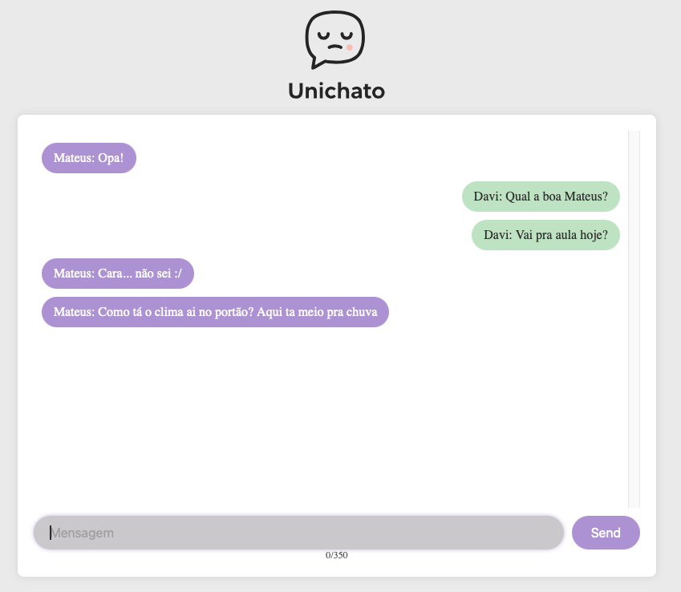

# UniChato.space 🧑‍💬

Sistema de chat em tempo real feito com Go e WebSocket, com uma interface web responsiva. Ideal para estudos, encontrar novos amigos e se atualizar das novidades na faculdade e nos grupos. Tudo em tempo real!

## 🔗 Acesse o Unichato:

[https://www.unichato.space](https://www.unichato.space)

---

## ✨ Tecnologias Utilizadas

- **Backend:** Golang + Gorilla WebSocket
- **Frontend:** HTML, CSS, JavaScript vanilla
- **Hospedagem:** Render

---

## 📦 Estrutura de Pastas

```
├── controller      # Lógica de WebSocket e manipulação de conexões
├── models          # Modelos de dados (ex: Message)
├── view            # HTML, CSS, JS (interface visual)
├── main.go         # Ponto de entrada da aplicação
├── README.md       # Documentação do projeto
```

---

## 🚀 Como rodar localmente

### Pré-requisitos

- Go instalado ([https://go.dev/doc/install](https://go.dev/doc/install))

### Passos

```bash
# Clone o repositório
$ git clone https://github.com/seu-usuario/uni-chato.git

# Acesse a pasta
$ cd uni-chato

# Rode o projeto
$ go run main.go
```

Acesse: `http://localhost:8080`

---

## 🧩 Funcionalidades

-

---

## 🧑‍💻 Como contribuir

1. Faça um fork
2. Crie uma nova branch (`git checkout -b feature/nova-funcionalidade`)
3. Commit suas alterações (`git commit -m 'feat: nova funcionalidade'`)
4. Faça push para o seu fork (`git push origin feature/nova-funcionalidade`)
5. Abra um Pull Request 🧵

---

## 📷 Captura de tela




---

## 🙌 Agradecimentos

- [Gorilla WebSocket](https://github.com/gorilla/websocket) pela excelente lib
- [Render](https://render.com) pela hospedagem simples e eficaz
- A equipe que desenvolveu esse projeto massa 💜
  - Arthur de Souza Linsingen Vieira
  - Bruno Schmaiske Quoos
  - Evelyn Maria Gura
  - Gabriel Anibaletto
  - Gabriel Carvalho de Abreu
  - Jéssica Cavichiolo
  - Kawan Cavalcante
  - Pedro Henrique Ribeiro


---

Made by [Bruno Schmaiske Quoos]
